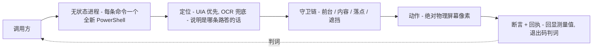

# Agent Computer Use 开源版 v2.5.2

[](LICENSE)
[](#环境要求)
[](#环境要求)
[](#目录结构)
[](#自测)

一个**单文件、无状态的 Windows 桌面自动化命令行工具**，为 AI agent 驱动而生——你自己在 shell 里用也一样。

`desktop.ps1` 给 agent 提供 "computer use" 的四件基本能力：**看**（整屏 / 窗口 / 区域的截图，外加 OCR）、**指**（在真实像素坐标上移动 / 点击 / 滚动 / 拖拽）、**打字**（键盘、剪贴板、以及直接走 UIA 写值）、**读界面树**（UI Automation，另有一条 Chrome DevTools 通道）。没有常驻进程、没有安装器、没有第三方依赖——每条命令都是一次短命的 `powershell -File` 调用，所以整套东西可审计、也很难进入卡死状态。上面的 badge 只是文档图片，不是要装的东西：除了这一个文件，没有任何可安装项。

> 🇬🇧 English edition: [README.md](README.md)

## 目录

- [亮点](#亮点)
- [设计取舍](#设计取舍)
- [一次调用的链路](#一次调用的链路)
- [与其它方案的差异](#与其它方案的差异)
- [环境要求](#环境要求)
- [快速上手](#快速上手)
- [窗口选择器 `<sel>`](#窗口选择器-sel)
- [命令一览](#命令一览)
- [从屏幕上取一个坐标：这是顺序，不是清单](#从屏幕上取一个坐标这是顺序不是清单)
- [已知限制（都是踩出来的）](#已知限制都是踩出来的)
- [截图坐标系（读一次，少踩所有脱靶）](#截图坐标系读一次少踩所有脱靶)
- [自测](#自测)
- [目录结构](#目录结构)
- [许可](#许可)

## 亮点

|  | 一句话 | 展开读 |
|---|---|---|
| **四件原语** | `see`（截图 + OCR）、`point`（真实像素上移动 / 点击 / 滚动 / 拖拽）、`type`（键盘、剪贴板、UIA 写值）、`read`（UIA 树、Chrome 通道） | [快速上手](#快速上手)、[命令一览](#命令一览) |
| **默认带守卫** | 按键只在目标确实拿到前台之后才发出——发完还会再查一次 | [设计取舍](#设计取舍) |
| **绝不静默** | 每个数字都注明它来自哪次测量（`source=uia|ocr`、`occluded=N%`、`hit-window:`、具名回执）；0 从来不是"不存在"的证据 | [设计取舍](#设计取舍) |
| **有审计** | 每条实际执行的动作追加一行日志；键入内容默认脱敏；`replay` 拒绝重放已脱敏的步骤 | [设计取舍](#设计取舍) |
| **自带回归** | 离线回归门禁（源码 lint、每个纯函数的单元检查、文档与分派器一致性契约）几秒跑完，不碰桌面 | [自测](#自测) |
| **DPI 安全** | 读任何坐标之前先声明 Per-Monitor V2 感知；混合 DPI 多屏同样逐像素准确 | [设计取舍](#设计取舍) |
| **无状态单文件** | 没有常驻进程、没有安装器、没有第三方运行时依赖——一个纯 ASCII 的 PowerShell 文件 | [设计取舍](#设计取舍) |

## 设计取舍

- **刻意无状态。** 每次调用新起一个 PowerShell 进程（约 0.3–0.6 秒）。比常驻宿主慢，但没有会泄漏、会崩溃、难调试的后台进程。出错时，全部信息就在这一条命令的 stdout 和退出码里。
- **默认带守卫。** 按键物理上永远落在"当前焦点窗口"上，所以 `type` / `keys` / `paste` / `paste-file` 带 `--to <sel>` 时，会**先校验目标确实拿到了前台，才发第一个键**；校验不过直接 `ERROR` + 退出码 1，一个键都不发（`--force` 可跳过，退回旧行为）。发完之后**还会再查一次前台**，中途被抢走焦点同样算失败并告警。这条规则来自真实事故：`SetForegroundWindow` 可能被系统前台锁静默拒绝，盲发的按键落进了别的程序。
- **知道自己是怎么知道的，并且说出来。** 这是整套功能围绕生长的设计准则：一个数字、一句"没找到"，如果不同时打印它来自哪次测量，就没有价值。于是 `find` 会报 `source=uia|ocr`；落空时会说出两条路各自量到了什么；`hit-window:` 打印你的点击**真实落在**哪个窗口；截图类命令回显图像→屏幕的换算式；`--expect` 的判词会写明实际生效的耐心值与轮询间隔；`paste` 会点名它凭哪种"回执"接受了一个被折叠成附件条的长文本。**0 从来不是"不存在"的证据**，一个只可能通过的检查不算检查。
- **有审计。** 每条实际执行的 act/text/clipboard/uia-settext 命令向 `shots/actions.log` 追加一行：UTC 时间戳、命令、参数、解析到的目标。键入内容与守卫串以 `<redacted:Nchars>` 存（要原文就显式传 `--log-payload`）；只记文件**路径**，绝不记剪贴板内容和文件正文。日志 512KB 轮转，保留最新 5 个 `actions_*.log` 存档；`replay` 会**拒绝**正文已被脱敏的步骤——把占位符重放出去就等于把占位符打进目标。
- **自带回归。** `selftest` 跑离线门禁（当前约 590 条：针对 PowerShell 5.1 `@(Fn)` 列表返回陷阱的源码 lint、BOM/ASCII 不变式、每个纯函数的单元检查，以及钉住文档与分派器一致性的契约检查）。`selftest --live` 追加真实桌面往返，只操作自己创建的 `DTX-*` 夹具窗口，不碰你的应用。
- **DPI 安全。** 读取任何坐标前，进程先声明 **Per-Monitor V2** DPI 感知（Windows 10 1703+；更老的系统自动回退 System-aware）。不做这一步，Windows 会按显示缩放比例虚拟化所有数值（150% 缩放下，2100×1350 的窗口会被读成 1400×900），截图裁切、点击偏移。Per-Monitor V2 还额外保证多块显示器**缩放比例不一致**（混合 DPI 多屏）时，副屏上的坐标与截图同样逐像素准确。用 `dpi` 命令可查看实际拿到的感知模式和每块显示器的物理像素边界。
- **源码纯 ASCII。** PowerShell 5.1 会把无 BOM 的 UTF-8 脚本按 ANSI 误读，所以脚本里没有任何非 ASCII 字面量（文件本身带 UTF-8 BOM，这正是 5.1 按 UTF-8 解码的原因）。中文等非 ASCII 文本一律通过 `paste <file>` 或 `uia-settext <sel> <name> <file>` 从外部 UTF-8 文件进入。

## 一次调用的链路

每条命令走的都是同一条短链路；调用之间不携带任何状态：



被拒绝的动作同样是一个判词：守卫失败时会打印失败原因并以非零退出码结束，**在碰任何东西之前**。拒绝从不静默；一张将被读取的截图如果处于被遮挡状态，它打印的每一行都会自己说明。

## 与其它方案的差异

只写差异，不排名——下面每一种方案都有它买到的东西和付出的代价。他人产品的内部实现未公开之处，本文不做任何断言。

| 维度 | 本工具 | 云 VLM 类 "computer use" 方案 | AI IDE 内置桌面自动化（Work 模式一类） | 终端 coding agent（如 Codex CLI） |
|---|---|---|---|---|
| 定位方式 | 本地 UIA 优先、OCR 兜底；命令会打印是哪条路答的话、两条路各量到了什么 | 由托管视觉模型读截图——按这个类别的定义，没有本地 UIA/OCR 定位器 | 内部未公开——不写死 | 终端优先：shell 和代码仓库就是它的界面，不是屏幕像素 |
| 决策与执行是否在本地 | 是——一个本地进程，不联网 | 否——决策模型在云端，屏幕内容因此离开本机 | 自动化动作发生在本机；决策调用是否出网未公开——不写死 | CLI 本地运行；代码模型推理是一次云端 API 调用 |
| 可审计 | 一个纯 ASCII 源文件，外加追加式动作日志（内容默认脱敏） | 模型闭源、宿主闭源 | 闭源功能 | CLI 开源——但托管模型本身不可审读 |
| 可离线验证 | 是——离线自测几秒重验文档契约，不需要桌面 | 否——行为取决于托管模型的输出 | 没有公开对应物 | 框架可测；模型输出不确定 |
| 是否拦截误操作 | 硬前台守卫（发送前后各一次）、内容守卫、遮挡拒绝 | 因产品而异；这个类别没有"前台"概念 | 未公开 | 命令审批与沙箱闸，不是窗口级守卫 |

**本工具付出的代价**（上述差异的另一面）：没有 VLM，就意味着没有对任意界面的开放语义理解——它找得到能 OCR 出来的文字和暴露了名称的控件，找不到"那个看上去像登录框的东西"。每次调用都要付一次新进程启动（约 0.3–0.6 秒）。只支持 Windows。守卫有时会拒绝一个**本来合法**的动作——桌面处于意外状态时就会这样；拒绝是大声的、设计如此，但拒绝终究是拒绝。

## 环境要求

- Windows 10/11，PowerShell 5.1（系统自带）或更高
- OCR 使用 Windows 内置的 Windows.Media.Ocr 引擎；机器上装了哪些语言包，就能认哪些字（`ocr-cap` 会列出来）
- 不需要装任何模块、包或依赖

## 快速上手

```powershell
# 现在屏幕上有什么？
powershell -ExecutionPolicy Bypass -File desktop.ps1 wins

# 给某个窗口截图（标题子串 / 数字 PID / proc:notepad / class:<子串> 都行）
powershell -ExecutionPolicy Bypass -File desktop.ps1 win notepad shot.png

# 这段文字在哪（屏幕像素）？先 UIA 再 OCR，并说明是哪条路答的话
powershell -ExecutionPolicy Bypass -File desktop.ps1 find "文件" --to notepad

# 在绝对屏幕坐标点击
powershell -ExecutionPolicy Bypass -File desktop.ps1 click 800 500

# 发 Ctrl+S —— 但只有目标确实在前台时才发
powershell -ExecutionPolicy Bypass -File desktop.ps1 keys --to notepad "^s"

# 输入中文：写进 UTF-8 文件再粘贴（用后恢复剪贴板，并默认回读尾部）
powershell -ExecutionPolicy Bypass -File desktop.ps1 paste --to notepad .\samples\selftest.txt

# 往聊天类应用发文件：文件进剪贴板（FileDrop）+ Ctrl+V
powershell -ExecutionPolicy Bypass -File desktop.ps1 paste-file --to "MyChatWindow" C:\path\to\file.zip
```

`help <命令>` 打印单条命令的说明（旗标、语义、版本注记）；`help --<旗标>` 打印提到该旗标的每一行。

## 窗口选择器 `<sel>`

- **数字 PID** 只按进程号匹配。该进程若有多个顶层窗口（主窗口 + 模态对话框），**当前在前台的那个优先**（`pick=fg`），否则取最大的未最小化窗口（`pick=largest`）。
- 其它字符串是**大小写不敏感的标题子串**；`proc:<名>` 精确匹配进程名，`class:<子串>` 按子串匹配窗口类。
- 子串本身就是纯数字时，加 `t:` / `title:` 前缀强制按标题匹配。
- 标题 / proc / class 选择器**命中多个窗口时工具会拒绝解析**，并把每个候选都打出来——它不会静默挑最大的。请用 pid、`proc:` 或 `class:` 消歧。
- 最小化窗口（停在 −32000,−32000）只作为最后手段。

## 命令一览

所有坐标都是**物理屏幕像素**。

### 读取与测量

| 命令 | 作用 |
|---|---|
| `shot [outPath] [--fit px] [--grid [步长]] [--mark x,y]` | 整屏截图（虚拟屏全范围） |
| `win <sel> [outPath] [--fit px] [--grid] [--mark x,y]` | 单窗口截图；回显自带图像→屏幕换算式与 `occluded=N%` 遮挡判词 |
| `rect <x> <y> <w> <h> [outPath] [--fit px] [--grid] [--mark x,y]` | 区域截图（默认 `--fit 900`，肉眼量坐标能扛住查看器的下采样） |
| `zoom <x> <y> <w> <h> [scale] [outPath]` | 小区域截图并**放大**（默认 2x，最近邻）+ 回显 `screen = (x + ix/scale, y + iy/scale)` |
| `wins` | 列出可见窗口：`pid proc class popup owner main rect size title` |
| `info <sel>` | pid / 句柄 / 进程名 / 类 / owner / main / 矩形 / `pick=`（为什么选中它） |
| `rect-of <sel>` | 只输出 `x y w h`，方便算相对坐标 |
| `cursor` | 当前光标位置 |
| `dpi` | 启动时实际拿到的 DPI 感知模式 + 每块显示器的物理像素边界 |
| `color-at <x> <y>` | 取某像素颜色，输出 `#RRGGBB`（指示灯、转圈等没有文字的反馈） |
| `find-color <x> <y> <w> <h> <#RRGGBB> [--tolerance n] [--all]` | 区域内首个（或全部，上限 500）匹配像素 |
| `hash <sel|x y w h>` | 区域截图的 MD5 —— `assert-hash` 的输入 |
| `find <文本...> [--target <sel>] [--region x,y,w,h] [--needle <文本>]` | **复合定位器**：先 UIA，同矩形再 OCR 兜底，并且报 `source=uia|ocr`；落空时说出两条路各自量到了什么 |
| `find-text <sel|x y w h> <文本...> [--all] [--scale auto|1|2|tiled]` | OCR 区域，返回匹配行的屏幕矩形 + 可直接用的中心点 |
| `read-text <sel|x y w h> [--max-lines n | --all-lines] [--filter 子串]` | OCR 区域，打印每行文本及其屏幕矩形；`--filter` 只留命中行 |
| `ime` | 前台线程的键盘布局 / IME 状态（`ime=yes` 表示中文输入法激活中，`keys` 可能被候选窗吞掉；`type` 不经过 IME） |
| `ime-state` | 转换模式（字母态 vs 中文态），经默认输入法窗口读取 |
| `ime-en [hkl]` | 把前台线程的转换模式切到字母态并**读回**；回显会打出恢复原模式的确切命令 |
| `ime-cn [mode]` | 切到中文输入态并读回；同样附带恢复命令 |
| `ocr-cap` | 只读：OCR 引擎的 `MaxImageDimension`、已装语言包、当前语言 |
| `a11y-probe <sel> [bigDepth]` | 只读：两个深度下的控件数 + 页面区可交互控件数 → `page-tree=exposed|collapsed`，即 `uia-*` 到底能不能驱动这个应用 |
| `challenge-probe <sel>` | 只读：对验证码做 OCR，给出匹配 / 置信度 / 是否陈旧 + 人工接管信息块。**设计上不含求解器**（见限制 12） |
| `status-summary [--json]` | 只读汇总一次工作区状态：HEAD、是否干净 / 领先、离线 selftest 三数、最新一次 live 日志及其红位数、残留的夹具窗口 |
| `shots-cleanup [--keep n] [--go] [--quarantine <目录>]` | 给运行期截图目录封顶 —— **默认空跑**；`--go` 是把文件**移入**隔离目录并写清单，不是删除。`--go` 的目标：`--quarantine <目录>` 优先，其次 `DTX_QUARANTINE` 环境变量，两者都没有就拒绝执行（exit 2）并点名两条出路——不再内置任何机器专属路径 |
| `help [<命令>|--<旗标>]` | 不带参数是本页；`help shot` 只看一条；`help --grid` 打印提到该旗标的所有行 |

### 断言（退出码检查点，绝不点击）

| 命令 | 作用 |
|---|---|
| `assert-window <sel>` | 有窗口匹配则退出码 0 |
| `assert-text <sel|x y w h> <文本...>` | OCR + 退出码检查；支持 `--allow-occluded` / `--occlude` |
| `assert-color <x> <y> <#RRGGBB> [tol]` | 像素等值判定（指示灯、转圈） |
| `assert-hash <sel|x y w h> ==|!= <hash>` | 区域 MD5 与 `hash` 给出的值比对 |
| `assert-stable <sel|x y w h> <sec>` | 连续两帧完全一致 = 已稳定（对闪烁光标永远为假） |
| `assert-changed <sel|x y w h> <sec>` | 反过来：等区域**确实变化**；超时即"这一步大概什么都没做" |

### 等待

| 命令 | 作用 |
|---|---|
| `wait-win <sel> <timeoutSec>` | 每 500ms 轮询直到匹配窗口出现 |
| `wait-gone <sel> <timeoutSec>` | 轮询直到它消失（对话框关闭、操作生效） |
| `wait-stable <sel|x y w h> <timeoutSec> [--interval ms]` | 轮询直到连续两次截图哈希相同——用来替掉固定 sleep |

### 操作类（绝对屏幕坐标）

| 命令 | 作用 |
|---|---|
| `move <x> <y>` | 移动光标 |
| `hover <x> <y> [--dwell ms]` | 移过去并且**停住** —— 悬浮提示需要停留时间（默认 800ms）才渲染 |
| `click <x> <y>` | 左键；`--to <sel>` 先激活并校验窗口，`--guard-text`/`--guard-region` 在点击**之前**断言界面语境 |
| `rclick <x> <y>` | 右键，守卫同上 |
| `dblclick <x> <y>` | 双击，守卫同上 |
| `drag <x1> <y1> <x2> <y2> [--steps n] [--hold ms]` | 真按住再走再放（拖窗口、拖滑块、拖滚动条）；steps 默认 14，hold 默认 120ms |
| `press-down <x> <y> [--max-hold ms]` | 按下并**保持住**，让你先看清楚再松手。三道看门狗，因为按住的左键是**全机器级**状态：进程内超时释放、下一次调用发现还按着就释放并说明、回显明写 DOWN 与截止时间 |
| `drag-to <x> <y> [--steps n]` | 在**已按住**的状态下从当前光标处继续走；没按住时**拒绝**（那种情况该用上面的 `drag`） |
| `press-up <x> <y>` | 松手——判定落在松手处，所以 `--expect-change` 在这里生效；没按着时**拒绝**，绝不谎报一次没发生的释放 |
| `wheel <amount> [x y | --at <sel>] [--focus-first]` | 滚轮（负数向下）；回显会说明这个滚轮事件真正落在哪个窗口上 |
| `relclick <sel> <dx> <dy>` | 窗口内相对坐标点击（窗口移动了也不用重算） |
| `find-click <sel|x y w h> <文本...> [--index n] [--aim-line]` | OCR 定位文本，并点击命中行里**该文本自己那一段**（一次调用顶替 find-text → 读回显 → click） |
| `imgclick <outPath> <ix> <iy> [--dry] [--stale-ok]` | 通过图像旁边的 `.map.txt` 把你在图上看到的像素反算成屏幕坐标再点击；窗口自截图后移动/缩放超过 2px 时**直接失败** |
| `unmap <outPath> <ix> <iy>` | 同一套换算，只打印不点击、不写日志 |
| `win-move <sel> <x> <y>` | 移动窗口（可见左上角落在 x,y） |
| `win-resize <sel> <w> <h>` | 设置**可见**尺寸（已按 DWM 边框校正） |
| `win-max <sel>` | 最大化 |
| `win-min <sel>` | 最小化 |
| `win-restore <sel>` | 从最小化/最大化恢复 |
| `win-close <sel>` | 温和的 `WM_CLOSE`（不是杀进程） |
| `menu-pick <sel> <文本...> [--index n] [--allow-window]` | 解析出**弹出菜单**那个窗口，OCR 它的行，点击包含目标文本的那行。不是菜单形状的窗口一律**拒绝**（判据不是 `WS_POPUP` 样式位，见限制 9） |
| `open-and-pick <sel> <opener-x> <opener-y> <文本...> [--region x,y,w,h]` | 一个进程内：点击展开器、等一拍、给目标窗口拍照、点击第一行含目标文本的行——专为 `menu-pick` 有意拒绝的自绘下拉框准备 |

### 文本类（永远核对"目标"与"实际前台"）

| 命令 | 作用 |
|---|---|
| `focus <sel>` | 恢复 + 置顶，打印 `fg_ok=True/False` |
| `type [--to <sel>] <文本...> [--verify] [--force]` | 走 SendInput Unicode，字符完全绕过 IME，中文可直接输入；`--verify` 发送后用 OCR 读目标，看不到这段文本就大声失败（密码框请跳过） |
| `type-in <x> <y> [--tab <n>] <文本...> [--verify]` | 先点一下、发 n 个 TAB、再输入——为 webview/Electron 表单而设，那里**光点击拿不到键盘焦点** |
| `keys [--to <sel>] <spec> [--force]` | 原生 SendKeys 语法：`^s`、`%{F4}`、`{ENTER}`（`keys` 仍然经过 IME） |
| `paste [--to <sel>] <文件> [--expect <串>|--no-expect] [--force]` | UTF-8 文件 → 剪贴板 → Ctrl+V，事后恢复原剪贴板。**回读默认开启**：把正文尾部读回来核对；正文长到显示不出尾部（折叠成了附件条）时改凭一种**具名回执**接受，绝不静默 |
| `--guard-text <needle>` / `--guard-region x,y,w,h=<needle>` | 文本类命令专用：目标可见才发送——由工具强制"只对这个会话说话"。守卫区域被遮挡时**在 OCR 之前**就失败，守卫不可能读到覆盖层的文字并当成语境 |

### 剪贴板

| 命令 | 作用 |
|---|---|
| `copy-file <路径>` | 把本地文件以 FileDrop 放上剪贴板并自证；**刻意留在**剪贴板上 |
| `paste-file [--to <sel>] <路径> [--guard-text <串>] [--force]` | copy-file + 前台守卫 + 内容守卫 + Ctrl+V + 恢复剪贴板；默认回读找的是**文件名** |

### 遮挡自证开关（每条读像素的命令都有）

`win`/`rect`/`shot`/`find-text`/OCR 各条路都在目标矩形上采一个 5×5 的 `WindowFromPoint` 网格（**不是**矩形重叠，所以全屏点击穿透层和 `Program Manager` 不会被算成覆盖者），打印 `scan=<角色> rect=(x,y,WxH) occluded=N% coveredBy=pid '标题'`，并在 stderr 把**每一个**覆盖者都单独列一行。守卫类与 `assert-*` 在被遮挡时**拒绝**执行；纯读取不因遮挡失败（要找的东西也许正在可见部分）。开关：`--occlude off|warn|strict`、`--occlude-grid n`、`--allow-occluded`。

### 界面自动化（仅当应用暴露了无障碍树）

| 命令 | 作用 |
|---|---|
| `uia-tree <sel> [maxDepth] [--actions-all\|--no-actions] [--no-paths]` | 打印控件树；表头说明扫的是哪个句柄、实际走到了第几层。每行还追加 `path=/0/2/1`（自根起的子下标路径——下标在遍历里就有，零额外跨进程调用，`--no-paths` 关）与交互类型节点的 `actions=[invoke,...]`（invoke/toggle/select/expand/value/scroll/range；不列 Text/Window 这类"能读什么"的模式——那是 read-text 的活）。pattern 探测**默认只探交互类型白名单**（每次探测都是一次跨进程调用）：Button/MenuItem/Edit/CheckBox/RadioButton/ComboBox/ListItem/TabItem/TreeItem/Hyperlink/Slider/SplitButton；`--actions-all` 探全树，`--no-actions` 完全关闭且 stdout 与上一版逐字节一致。成本在 **stderr** 自报：`actions-probed=K of M nodes (allowlist) elapsed=Xms`。`actions=` 只出现在真探过的节点——「没探」（无字段）与「探到空」（`actions=[]`）可区分 |
| `uia-path <sel> @/0/2/1 [maxDepth]` | 只读：把 `uia-tree` 行里的路径解析回那个节点，按同款字段打印——**没有 Name 的控件就用它够** |
| `uia-find <sel> <nameSub> [typeRe]` | 按名称/类型查找元素。空串一律**拒绝**（它匹配一切，命中不能证明任何事）；首次 0 命中且树很浅时**再接触一次**才让 0 成为结论（UIA 冷启动） |
| `uia-click <sel> <nameSub>` | InvokePattern，失败则回退为点击该元素的中心。`@path` 形态：`uia-click <sel> @/0/2/1 "T\|n\|X,Y,WxH"`——期望三元组 `Type\|nameSub\|rect` 从 `uia-tree` 行复制，`@` 前缀是唯一分流标记；走完路径**先重验证** ControlType/Name/rect，任一不符打印 `REFUSED: path=... stale` + 期望/实际 + 定位/OCR 回退提示，并 **exit 1 不点**。路径深度超出 maxDepth 自报 `path depth N > walked M`。失效路径绝不静默变成坐标点击 |
| `uia-focus <sel> <nameSub>` | SetFocus。`@path` 形态同 uia-click：`uia-focus <sel> @/0/2/1 "T\|n\|X,Y,WxH"` |
| `uia-settext <sel> <nameSub> <文件>` | 用 ValuePattern 写入 UTF-8 文件内容并读回校验——不碰键盘、不碰剪贴板。`@path` 形态：`uia-settext <sel> @/0/2/1 <文件> "T\|n\|X,Y,WxH"`，同样先验证后写入 |

UIA 根节点从**被选中的那个窗口句柄**解析，所以与主窗口共用 PID 的对话框能被精确寻址。

### Chrome / 页面内容

Chrome ≥136 在**默认 profile** 上拒绝调试端口（"DevTools remote debugging requires a non-default data directory"）——这是实测，不是传说。所以这里有两条通道，且不可互相替换。

| 命令 | 作用 |
|---|---|
| `chrome-a11y <on|off>` | 默认 profile 该走的路：带 `--force-renderer-accessibility` 重启 Chrome，让页面 DOM 进入 UIA 树，之后 `uia-find`/`uia-click`/`read-text` 能操作网页内容。前后各测一次页面区树，测不出变化就拒绝声称成功 |
| `chrome-menu-read` | UIA：打开 Chrome **自己的**应用菜单，列出它暴露的每个 MenuItem 名称，然后用 Escape 关掉，**不点击任何东西**——这是一台仍在使用的浏览器上取证据的办法（它会打开菜单，因此不是只读） |
| `chrome-tabs [--json]` | CDP：列出打开的标签页（id / 标题 / **只有 host+端口**——token 出现在路径段和出现在查询串里一样常见，所以两者都不打印） |
| `chrome-read <sel>` | CDP：读取匹配标签页的可见文本 |
| `chrome-find <sel> <文本...>` | CDP：找到包含该文本的最内层元素 → 物理屏幕矩形 + 中心点（缩放比例每次实测） |
| `chrome-click <sel> <文本...> [--dry]` | CDP：先 `chrome-find`，再在其中心走常规注入点击（守卫照常生效；刻意不使用 DOM 合成点击） |
| `chrome-debug-off` | CDP：优雅关闭并以**不带**调试旗标重启，并核实端点确实不再应答 |

CDP 通道只与 `127.0.0.1` 通信；`0.0.0.0`、局域网地址、裸端口、主机名都会被按规则拒绝。

### 批量

| 命令 | 作用 |
|---|---|
| `script <steps.json> [--dry-run] [--stop-on-error] [--shot-at n]` | 一个进程内连跑一个 JSON 步骤数组：每步的 `to` 是硬前台守卫（守卫失败整串中止），assert 作为检查点，支持每步 `retry`/`intervalMs` 与内容守卫。`require-popup <sel>` 挂载弹层存活守卫，后续每一步执行前重查；`release-popup` 解除 |
| `replay [<actions.log>] [--last n] [--grep s] [--go]` | 重放日志里记录的 act/text/clipboard 命令——**默认空跑**，`--go` 才执行。正文被脱敏的步骤会被拒绝；带弹层守卫中止标记的日志片段整段拒绝（半执行状态不该重放） |
| `selftest [--live]` | 工具自身的回归门禁：源码 lint + 纯函数单元检查 + 契约检查，加 `--live` 后对自己创建的 `DTX-*` 夹具窗口做真实往返 |

### script 步骤文件结构

步骤文件是**一个 JSON 数组**——不要包成 `{"steps": [...]}`。每一步只有一个动作键（与命令同名），外加可选字段：`to`（硬前台守卫）、`guard-text`、`guard-region`、`expectText`、`expectGone`、`index`、`retry`、`intervalMs`、`timeoutSec`、`require-popup`、`release-popup`、`must-be-foreground`。

```json
[
  { "desc": "bring the window forward (hard foreground guard)", "focus": "Notepad" },
  { "desc": "type with a content guard", "type": ["QX EXAMPLE TEXT"], "to": "Notepad", "guard-text": "Edit" },
  { "desc": "OCR decides where to click", "find-click": ["Notepad", "File"], "expectText": "Open" },
  { "desc": "checkpoint", "assert-text": ["Notepad", "Open"] },
  { "desc": "settle", "sleep": 500 }
]
```

`--dry-run` 只做解析与计划，不碰任何东西；每次真跑 `script` 之前都建议先空跑一遍。

## 从屏幕上取一个坐标：这是顺序，不是清单

1. `find <文本>` —— 先 UIA 再 OCR，并且**说出**是哪条路答的话。
2. `uia-find <sel> <name>` —— 精确的名称/矩形/enabled/offscreen，含冷启动复测。
3. `find-text` / `find-click` —— OCR 这条路：行矩形 + 可直接用的中心点，不需要控件。
4. `imgclick  <ix> <iy>` —— 从"你在保存下来的图上看到的像素"到"屏幕点击"的**唯一**受支持路径：它读的是 `win`/`rect`/`zoom` 写在那张图旁边的 `.map.txt`。

在一张被缩放或被下采样的截图上用肉眼量点，不是第 5 步，也不算一种方法。这是量出来的代价：一次会话里这样点了四次，四次都错，而且每一次都要一个来回才发现。

## 已知限制（都是踩出来的）

1. **Chromium 壳应用**（Electron/Tauri 系编辑器、聊天客户端）暴露的无障碍树经常停在 `Pane` —— 那里 `uia-*` 无用，退回截图 + 坐标。设置 `SPI_SETSCREENREADER` 系统旗标**不会**让 Chromium 展开树（已测）；唯一可靠路径是带 `--force-renderer-accessibility` 重启目标应用（`chrome-a11y` 就是干这个的，而且会自证）。
2. **UIA 的第一次接触可能很浅。** 无障碍树是被"有客户端连上来"点亮的，而且常常要等触发它的那次遍历结束之后才亮。所以 `uia-find` 在让 0 成为结论之前**再接触一次**；复测仍然为空时，它说的是"没有叫这个名字的节点"，绝不是"那里什么都没有"。
3. **"窗口在前台" ≠ "输入框有焦点"。** 往 Chromium 的输入框里粘贴，得先点那个输入框（`relclick`）再 `paste`。请用截图核验，别只信命令的回显。
4. **Windows 通用文件对话框**："文件名"那个字段是一个不暴露可写 UIA 模式的 `Pane`，这是设计如此；`uia-settext` 会说明这点并让你改用 `click` + `paste`。
5. **`SetForegroundWindow` 有前台锁** —— 后台进程有时抢不走焦点（Windows 只闪任务栏）。守卫把这个静默失败变成大声的 `ERROR`，而不是让按键落进别的程序。操作桌面（`Program Manager`）尤其容易碰到；这是 Windows 的性质，不是本工具的 bug。
6. **单实例应用**（比如 Win11 的记事本会把新文档开成已有进程里的标签页）：`Start-Process` 返回的 PID 可能根本不拥有顶层窗口。用 `wins` 找真身。
7. **webview/Electron 表单：点击只给选中，不给键盘焦点。** 输入和粘贴会静默无效果。对策：点完补一个 `{TAB}` 把焦点送进真正的输入框——`type-in <x> <y> --tab 1 <文本>` 打包的就是这一步。
8. **激活中的输入法会吞按键**（空格可能被候选词吃掉）。`ime` 看状态；`type`/`type-in` 走 SendInput Unicode，根本不经过 IME；`keys` 会。必须落键而输入法又开着时，改走 `paste` —— 剪贴板这条路不经过 IME。
9. **`WS_POPUP` 样式位不等于"这是个菜单"。** 桌面、设置外壳、聊天客户端、若干应用外壳都带着它。`menu-pick` 按**类 + 形状**识别菜单，并且有意拒绝整窗——在一整个界面上"找包含该文本的行"会点到任何撞上来的东西。
10. **弹层窗口可以和主窗口共用一切。** 一个推广窗/对话框可能与应用主窗共享 pid、class 甚至 `WS_POPUP`，`popup=` 分不开它们 —— 这就是 `wins` 的行里要带 `owner=`（GW_OWNER）和 `main=`（一个 pid 所指的那一个主窗）的原因。
11. **截图不是实况。** `win` 拍到的是物理上盖在它上面的东西；读图之前先看 `occluded=N%` 的回显，必要时先把窗口抬到前台。
12. **验证码只读不解。** `challenge-probe` 只负责识别与报告。这类验证机制存在的目的就是阻止脚本化领取，去解它只会抬高账号自己的风控等级。`--allow-attempt` 只放行**一次**由调用方指名的点击，且这张图若还活着就会记一道引信，后续对同一张图的尝试一律拒绝。
13. **整窗读文本可能读到秘密。** 实测对聊天窗口做整窗 `read-text`，读数里带出过含会话 key 的支付 URL。请用 `--max-lines` / `--filter` 收窄，也不要记录你不必记录的原文。
14. **`selftest --live` 会真动桌面。** 它创建并关闭自己的 `DTX-*` 夹具窗口；只在没有别的东西需要前台时运行。另外：夹具进程仍是 System-aware DPI，而工具进程是 Per-Monitor V2 —— 单屏无影响，混合 DPI 多屏下夹具可能落偏。
15. **按键是物理输入** —— agent 在驱动时人不要碰鼠标键盘；agent 在做不可逆动作（发消息、删除）之前必须先用截图确认目标窗口。

## 截图坐标系（读一次，少踩所有脱靶）

所有截图都是**与屏幕 1:1 的物理像素**原始抓图 —— `shot` 覆盖整个虚拟屏，`win`/`rect`/`zoom` 覆盖一个带自报原点的区域。于是：`screen = image + (origin)`，每条截图命令的回显都会把它用到的换算式打出来。聊天窗口/AI 查看器常把 4K 截图**显示**成 50%，但文件本身没有缩放 —— 请按回显换算，别按图片看上去有多大。窗口矩形取自 `DWMWA_EXTENDED_FRAME_BOUNDS`（**可见**边框；`GetWindowRect` 那圈 7–11px 的隐形调整边会让每张 `win` 截图和每次 `relclick` 整体偏移），而 `win` 拍到的是物理上盖在它上面的内容 —— 遮挡要紧的时候先把窗口抬起来。

`--fit` 会**主动下采样**过宽的区域并在回显里打出所用比例；`--grid` 只在保存下来的 PNG 上叠坐标网格（**标注的是屏幕像素**；哈希与 OCR 判读的是未叠加的原图）；`--mark x,y` 画一个十字，用来"点之前先确认会点在哪"。

## 自测

```powershell
powershell -ExecutionPolicy Bypass -File desktop.ps1 selftest         # 离线门禁，完全不碰桌面
powershell -ExecutionPolicy Bypass -File desktop.ps1 selftest --live   # 追加在自建夹具窗口上的真实往返
```

离线门禁是提交前的硬要求：它把版本号在 `desktop.ps1`、两份 README 和 `CHANGELOG.md` 之间钉成一致；把两份 README 里写明的在册文件数与 `git ls-files` 的真实结果钉成一致；把**中英两份 README 的命令集合必须相同**钉成一致（只改一种语言就过不了门）；并把"每个分派器命令都得有 help 条目"钉成一致。任何 `FAIL` 都会让退出码非 0。

## 目录结构

```
desktop.ps1            # 工具本体（全部逻辑都在这一个文件里）
README.md              # 英文文档
README.zh-CN.md        # 中文文档（命令集合与英文版一致，由门禁钉住）
CHANGELOG.md           # 版本历史
LICENSE                # MIT
CONTRIBUTING.md        # 提 PR 前要跑什么（selftest、出网闸门、版本位）
SECURITY.md            # 工具能做什么、审计日志与脱敏、漏洞上报
.github/               # issue 模板 + PR 模板
samples/selftest.txt   # 验证粘贴写路径的中文样本
skill/                 # 可装载 Agent 技能：agent-computer-use/{SKILL.md, reference.md,
                       #   install.ps1, uninstall.ps1}
shots/                 # 运行期目录（已 gitignore）：默认截图 + actions.log
.cowork-temp/          # 运行期目录（已 gitignore）：--live 日志
```

本仓库 git 在册文件共 16 个（`tracked=16`，该数字由离线门禁与 `git ls-files` 比对钉住）。

## 许可

MIT —— 见 [LICENSE](LICENSE)。
